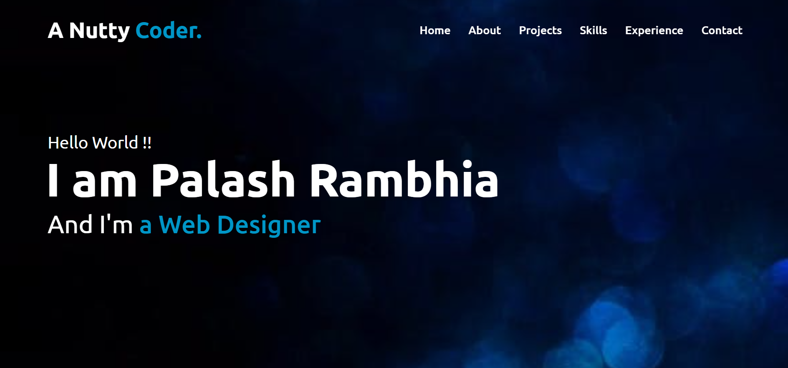
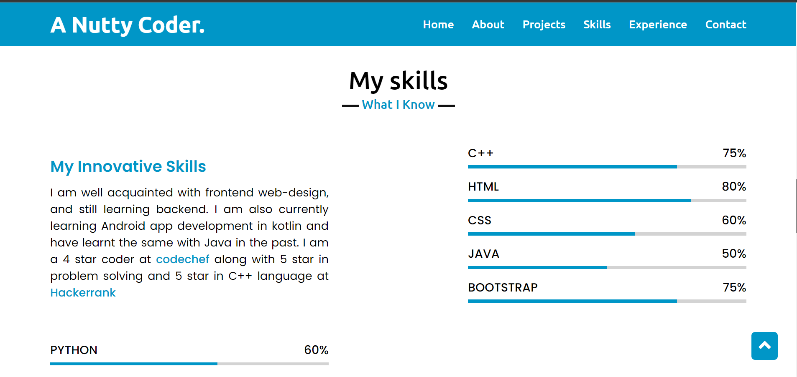
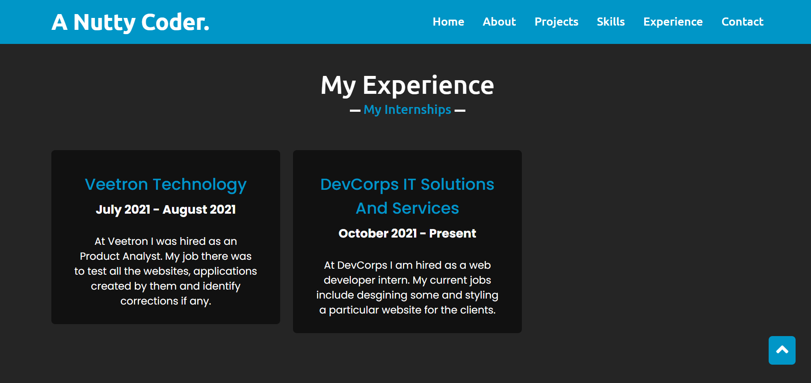

# Portfolio Website 

This is a portfolio website created by me using HTML, CSS and JS. It was a difficult as well as an intersting project which helped me learn a lot on my way. Everyline of code I wrote, I discovered something new. 

## Website Images :

